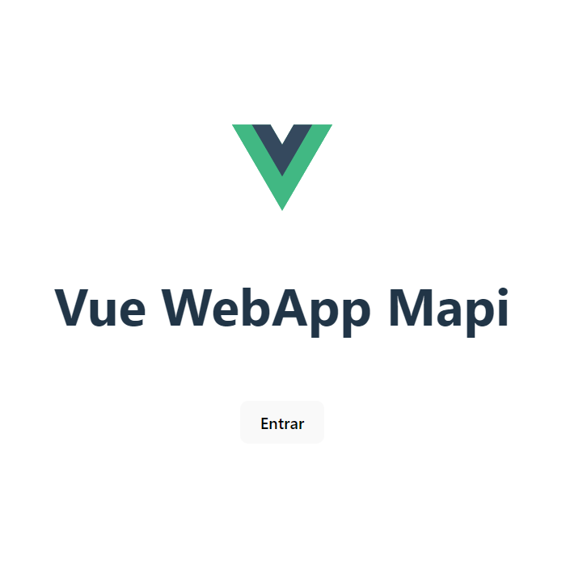
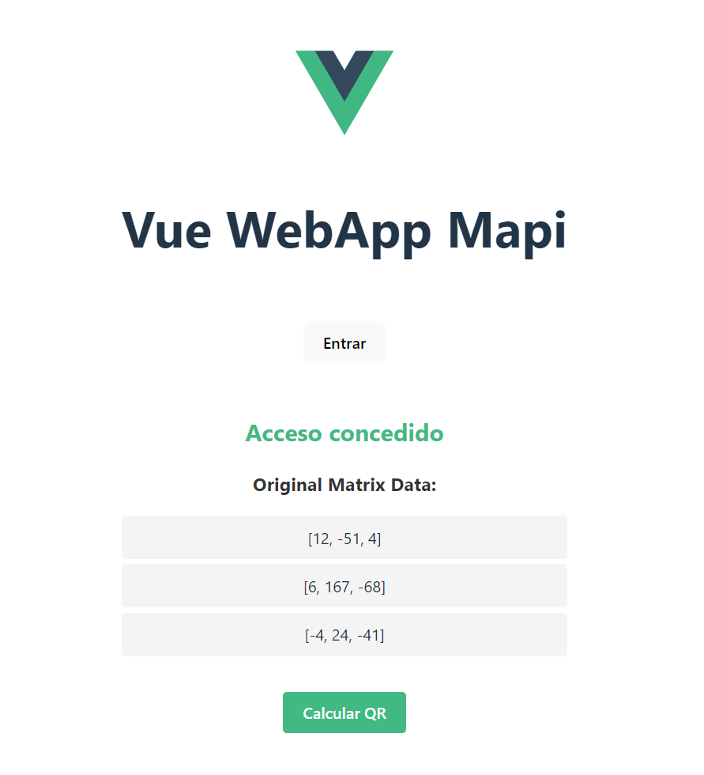
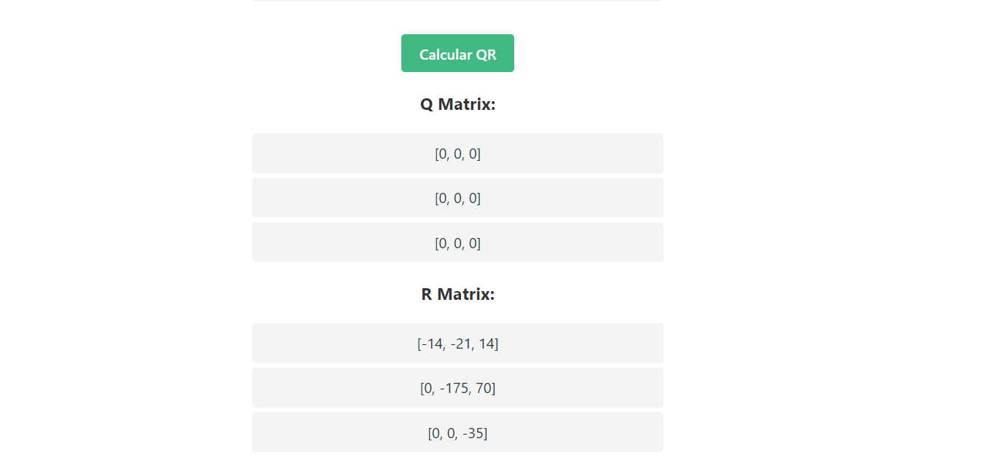
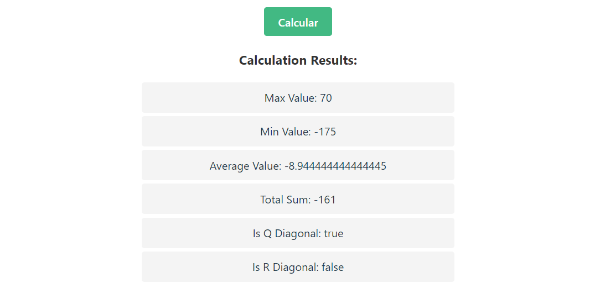

# QDS challenge

## Vue web app

# deploy dev mode

* clone repository
* `cd /webapp-mapi`
* `npm install`
* `npm run dev`

- local `http://localhost:5173`

- the web app require that `go-mapi` and `node-api` are alive

* go-mapi `http://localhost:3001`
* node-mapi `http://localhost:3000`

# deploy with docker
* `docker build -t my-vue-app .`
* `docker run -d -p 3003:3000 my-vue-app`

# STEPS AND SCHRENSHOTS

### inicio de la aplicación
!

### Cuando presione el boton Entrar
!

### Cuando presione el boton Calcular QR
!

### Cuando presione el boton Calcular
!

